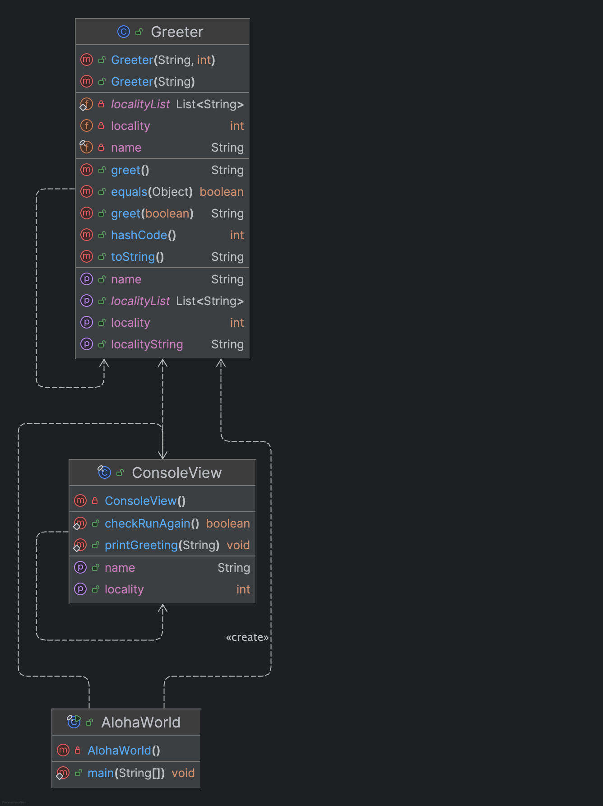

# Homework Aloha World Report

The following report contains questions you need to answer as part of your submission for the homework assignment.

## Design Doc

Please link your UML design file here. See resources in the assignment on how to
link an image in markdown. You may also use [mermaid][mermaid] class diagrams if you prefer, if so, include the mermaid code here.  You DO NOT have to include Greeting.java as part of the diagram, just the AlohaWorld application that includes: [AlohaWorld.java][AlohaWorld.java], [Greeter.java][Greeter.java], and [ConsoleView.java][ConsoleView.java].

### Program Flow

Write a short paragraph detailing the flow of the program in your own words. This is to help you understand / trace the code (and give you practice of something called a code walk that will be required in this course).

The AlohaWorld class serves as the entry point, initiating the application by prompting the user for their name and selecting a locality. It then creates an instance of the Greeter class with the provided information and displays the corresponding greeting message. The ConsoleView class manages user interactions, handling input and output operations. It prompts the user for their name and locality, displays the greeting message, and asks if the user wishes to be greeted again. The Greeter class contains the logic for generating personalized greeting messages based on the user's name and selected locality. It determines the appropriate greeting format and language, such as "Aloha" for Hawaii or "Ni Hao" for China, and returns the formatted greeting message. This structure ensures a clear separation of concerns, with each class handling specific aspects of the program's functionality.

## Assignment Questions

1. List three additional java syntax items you didn't know when reading the code.  (make sure to use * for the list items, see example below, the backtick marks are used to write code inline with markdown)

   * `@override`
   * `this`
   * `@BeforeEach`
2. For each syntax additional item listed above, explain what it does in your own words and then link a resource where you figured out what it does in the references section.

   * `@override` is used to indicate that a method is intended to override a method declared in a superclass.
   * `this`in Java refers to the current instance of a class. 
   * `@BeforeEach`is used to indicate that a method is intended to override a method declared in a superclass. 
3. What does `main` do in Java?
In Java, the `main` method serves as the entry point for program execution.
   
4. What does `toString()` do in Java? Why should any object class you create have a `toString()` method?
In Java, the `toString()`  returns a string representation of the object.

The primary purpose of overriding the `toString()`method in your classes is to provide a human-readable string representation of the object's state. 

5. What is javadoc style commenting? What is it used for?
Javadoc style commenting in Java involves using special multi-line comments to document classes, methods, and fields. These comments are to describe method parameters, return values, and exceptions, respectively.
  
6. Describe Test Driving Development (TDD) in your own words.

Test-Driven Development (TDD) is a software development methodology where developers write automated tests before writing the corresponding code. 
   
7. Go to the [Markdown Playground](MarkdownPlayground.md) and add at least 3 different markdown elements you learned about by reading the markdown resources listed in the document. Additionally you need to add a mermaid class diagram (of your choice does not have to follow the assignment. However, if you did use mermaid for the assignment, you can just copy that there). Add the elements into the markdown file, so that the formatting changes are reserved to that file.

## Deeper Thinking Questions

These questions require deeper thinking of the topic. We don't expect 100% correct answers, but we encourage you to think deeply and come up with a reasonable answer.

1. Why would we want to keep interaction with the client contained to ConsoleView?
   
  Keeping interaction with the client contained to the ConsoleView class adheres to the Separation of Concerns principle, a fundamental concept in software design. This principle advocates dividing a program into distinct sections, each addressing a separate concern, thereby reducing complexity and enhancing maintainability. 

  By isolating user interactions within the ConsoleView, the application achieves several benefits:

  (1)Enhanced Maintainability: Changes to the user interface can be made independently of the underlying business logic, simplifying updates and modifications.

  (2)Improved Testability: With a clear separation, unit testing becomes more straightforward, as the ConsoleView can be tested in isolation from other components.

  (3)Increased Reusability: Components like the Greeter class can be reused in different contexts without being tightly coupled to the user interface. 

2. Right now, the application isn't very dynamic in that it can be difficult to add new languages and greetings without modifying the code every time. Just thinking programmatically,  how could you make the application more dynamic? You are free to reference Geeting.java and how that could be used in your design.
   
  To enhance the application's flexibility and facilitate the addition of new languages and greetings without modifying the core codebase, we can implement the Strategy Design Pattern. This pattern allows the definition of a family of algorithms (in this case, greeting strategies), encapsulates each one, and makes them interchangeable. By utilizing this pattern, new greeting behaviors can be introduced dynamically at runtime.

  Benefits of This Approach:

  (1)Dynamic Behavior: New greeting strategies can be added at runtime without altering existing code, adhering to the Open/Closed Principle.

  (2)Maintainability: Each greeting behavior is encapsulated in its own class, making the codebase easier to manage and extend.

  (3)Testability: Individual greeting strategies can be tested independently, ensuring robustness and reliability.

> [!IMPORTANT]
> After you upload the files to your github (ideally you have been committing throughout this progress / after you answer every question) - make sure to look at your completed assignment on github/in the browser! You can make sure images are showing up/formatting is correct, etc. The TAs will actually look at your assignment on github, so it is important that it is formatted correctly.

## References

[^1]: Final keyword in Java: 2024. https://www.geeksforgeeks.org/final-keyword-in-java/. Accessed: 2024-03-30.
    
[^2]: Math (Java Platform SE 17). https://docs.oracle.com/en/java/javase/17/docs/api/java.base/java/lang/Math.html. Accessed: 2024-03-30.

[^3]:Strategy in Java.https://refactoring.guru/design-patterns/strategy/java/example

[^4]:Decorator in Java. https://refactoring.guru/design-patterns/decorator/java/example

[^5]:Separation of concerns. https://en.wikipedia.org/wiki/Separation_of_concerns

[^6]:MVC Design Pattern. https://www.geeksforgeeks.org/mvc-design-pattern

[^7]:Creating Instructions with Markdown Syntax.https://docs.skillable.com/docs/creating-instructions-with-markdown-syntax

[^8]:Extended Syntax.https://www.markdownguide.org/extended-syntax/

[^9]:Test-driven development.https://en.wikipedia.org/wiki/Test-driven_development?utm_source=chatgpt.com

 
<!-- This is a comment, below this link the links in the document are placed here to make ti easier to read. This is an optional style for markdown, and often as a student you will include the links inline. for example [mermaid](https://mermaid.js.org/intro/syntax-reference.html) -->

[mermaid]: https://mermaid.js.org/intro/syntax-reference.html
[AlohaWorld.java]: src/main/java/student/AlohaWorld.java
[Greeter.java]: src/main/java/student/Greeter.java
[ConsoleView.java]: src/main/java/student/ConsoleView.java
